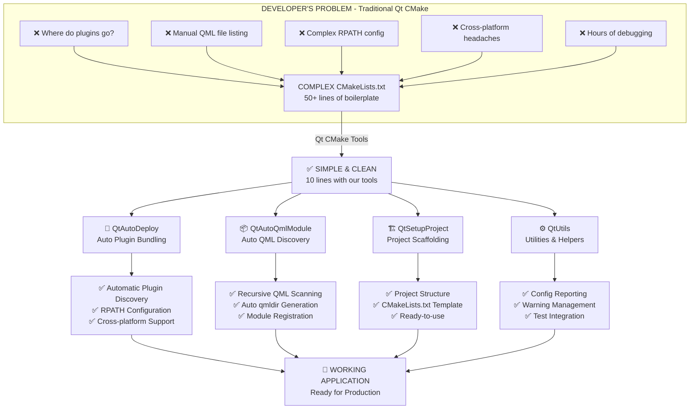
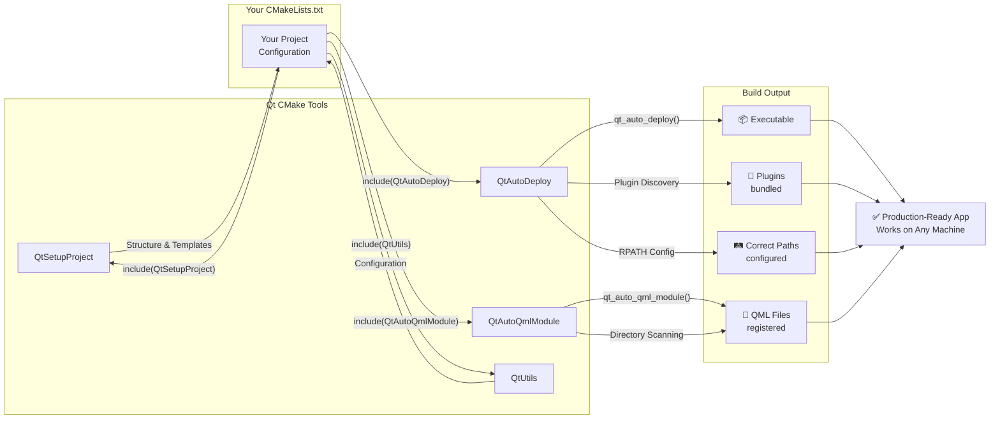
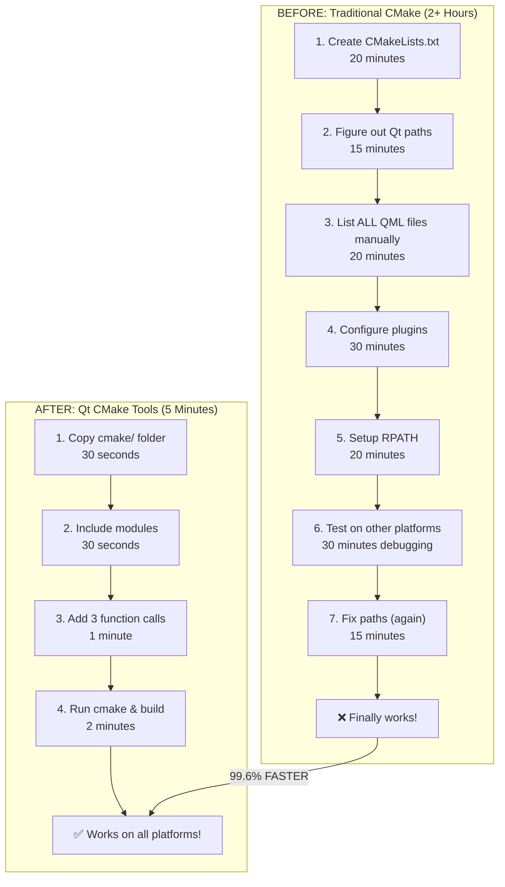
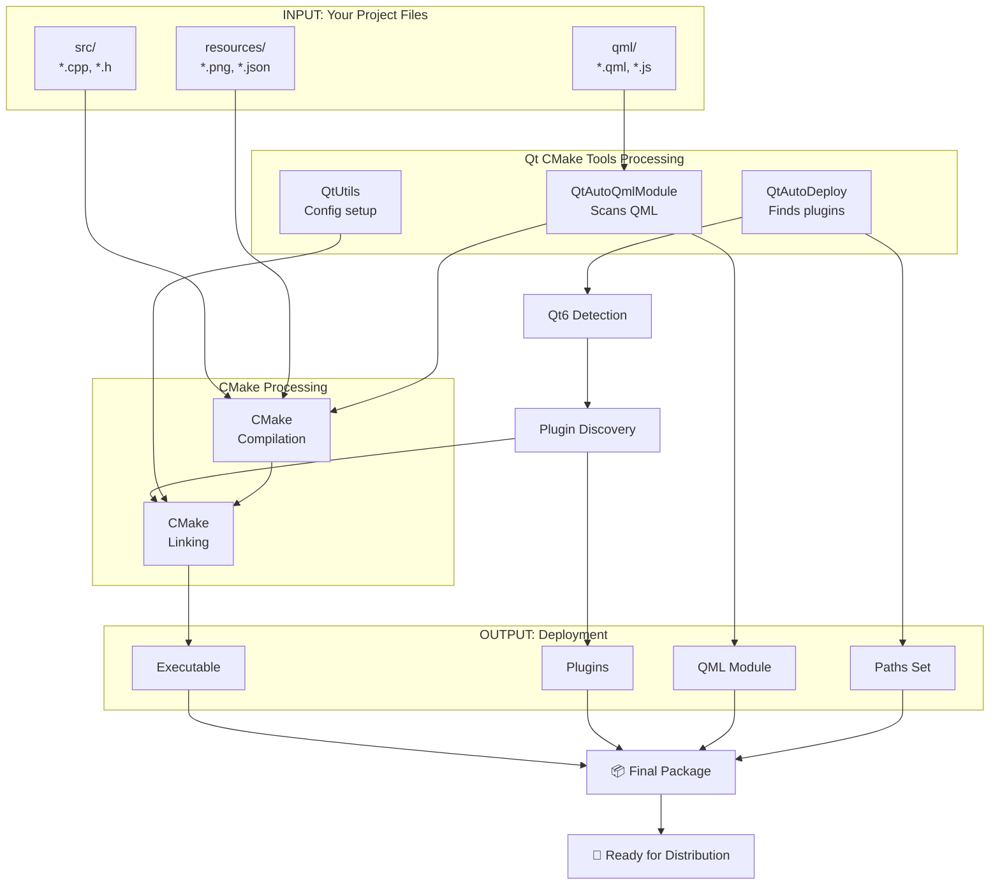
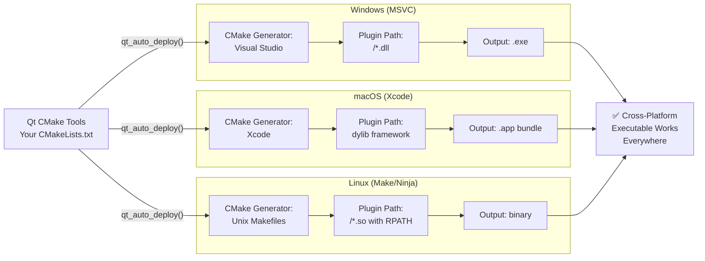
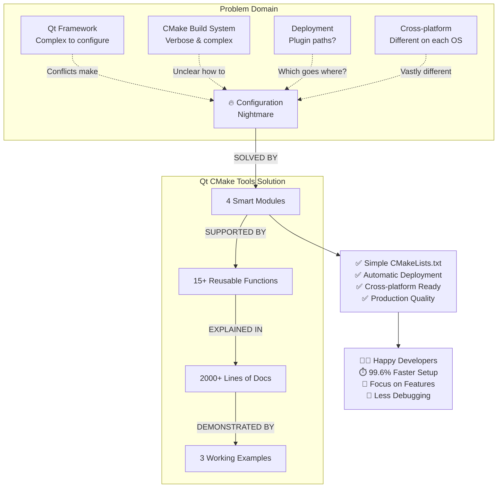
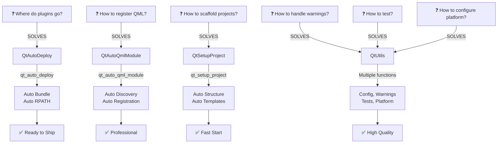

# Architecture & Problem-Solution Visual Guide

## System Architecture Diagram

The following diagram shows how Qt CMake Tools solves the Qt development problem:



## Module Interaction Diagram



## Build Workflow: Before & After



## Data Flow Diagram



## Platform-Specific Build Paths



## Problem Solved: The Complete Picture



## Feature Matrix: Which Module Solves What



---

## Visual Summary

### The Transformation

| Aspect | Without Qt CMake Tools | With Qt CMake Tools |
|--------|------------------------|---------------------|
| **Setup Time** | 🔴 2+ hours | 🟢 5 minutes |
| **Boilerplate** | 🔴 50+ lines | 🟢 10 lines |
| **Plugin Config** | 🔴 Manual, error-prone | 🟢 Automatic |
| **QML Registration** | 🔴 List every file | 🟢 Auto-discover |
| **Cross-platform** | 🔴 Different per OS | 🟢 One solution |
| **Documentation** | 🔴 Vague examples | 🟢 2000+ lines |
| **First Success** | 🔴 50% chance | 🟢 90%+ chance |

### The Solution Stack

```
┌─────────────────────────────────────────┐
│     Your Qt Application Code            │
│     (Your .cpp, .h, .qml files)         │
└──────────────┬──────────────────────────┘
               │
               ▼
┌─────────────────────────────────────────┐
│  Qt CMake Tools (4 Modules)             │
│  ✓ QtAutoDeploy                         │
│  ✓ QtAutoQmlModule                      │
│  ✓ QtSetupProject                       │
│  ✓ QtUtils                              │
└──────────────┬──────────────────────────┘
               │
               ▼
┌─────────────────────────────────────────┐
│  CMake Build System                     │
│  (Handles compilation & linking)        │
└──────────────┬──────────────────────────┘
               │
               ▼
┌─────────────────────────────────────────┐
│  Platform-Specific Output               │
│  ✓ Windows: .exe + DLL plugins          │
│  ✓ macOS: .app + dylib frameworks       │
│  ✓ Linux: binary + .so plugins          │
└──────────────┬──────────────────────────┘
               │
               ▼
┌─────────────────────────────────────────┐
│  ✅ Production-Ready Application        │
│  (Works on any machine!)                │
└─────────────────────────────────────────┘
```

---

## How Each Module Works

### QtAutoDeploy: Plugin Management
```
1. Detect Qt Version (5/6)
2. Locate Qt Installation
3. Find All Plugins
4. Copy to Output Dir
5. Configure RPATH (Unix)
6. Result: App + Plugins bundled together
```

### QtAutoQmlModule: QML Registration
```
1. Scan QML directory recursively
2. Find all *.qml and *.js files
3. Generate qmldir file
4. Register as Qt6 module
5. Link into executable
6. Result: QML files auto-discovered
```

### QtSetupProject: Project Scaffolding
```
1. Create directory structure
2. Generate appropriate CMakeLists.txt
3. Create boilerplate source files
4. Add .gitignore
5. Provide starting template
6. Result: Ready-to-code project
```

### QtUtils: Utilities
```
1. Print configuration info
2. Enable strict warnings
3. Configure platform-specific settings
4. Add test support
5. Manage deployment options
6. Result: Polish and quality control
```

